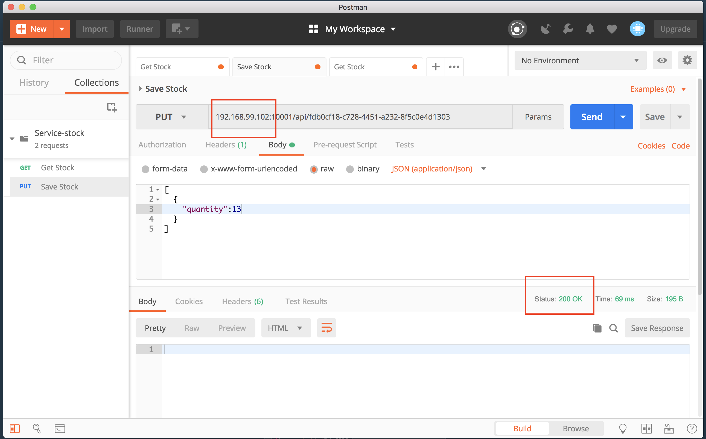
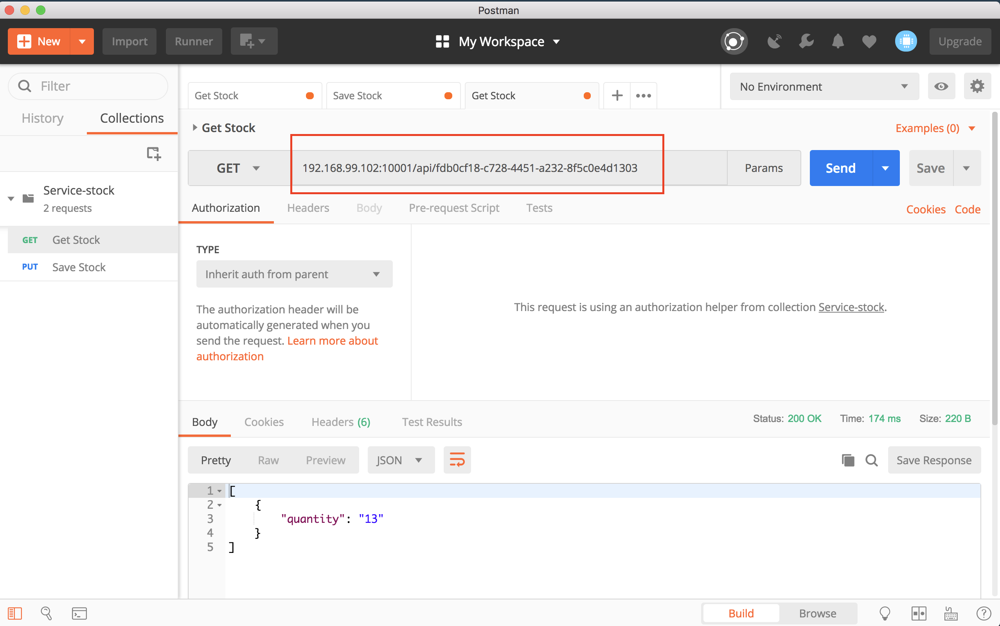
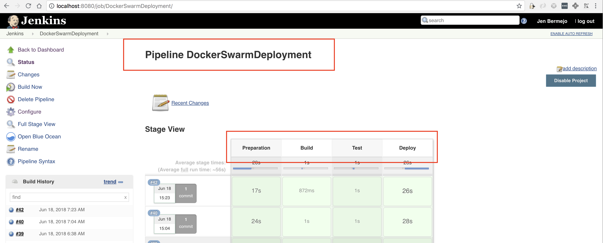
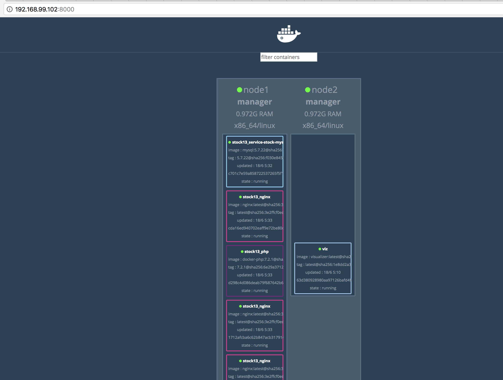

# PHP Application Running Docker Swarm Cluster

A simple PHP application running on docker swarm cluster.

## Introduction

These instructions will get you a copy of the project up and running on your local machine. Be sure to follow the installation and deployment guide to make this application up and running on your local.

A Jenkins server running on docker will be installed locally. From Jenkins, a Pipeline will be created to pull the source codes from the Github repo and run the rest of the stages in the pipeline. The application will be deployed on docker machines with VirtualBox drive.

Application will run on cluster (1 manager / 1 worker) via Docker Swarm. However you can add more worker nodes by simply creating more docker machines. The swarm cluster initialization will be done automatically by Jenkins thru the Pipeline.

## Prerequisites

* [Docker on Mac](https://docs.docker.com/docker-for-mac/install/) - we'll need this to create VMs on your local machine or   simply test your code using docker-compose.
  ```
    node1 = Swarm Manager
    node2 = Swarm Worker
  ```
* [Jenkins](https://jenkins.io/doc/book/installing/#downloading-and-running-jenkins-in-docker) - Docker image of Jenkins
* [Visualizer](http://callistaenterprise.se/blogg/teknik/2017/12/18/docker-in-swarm-mode-on-docker-in-docker/) - to be able to monitor the state of the cluster 
* [PhpUnit](https://hub.docker.com/r/phpunit/phpunit/) - Docker image for PhpUnit

## Installation

1. Create 2 VMs on you local machine using docker-machine create. Make sure VirtualBox is installed on your mac as well.
    
   I did not create the docker machines in my Jenkins server since I already have a VirtualBox installed in my Mac. I will later just add my remote VMs (docker machines) to my Jenkins server so I could run commands remotely to my docker swarm manager. Please see detailed guide on how to Connect your Jenkins server to a remote Docker host.
  
  To create docker machines:

  ```
  for i in 1 2 ; do
    docker-machine create -d virtualbox node$i
  done
  ```

  To list the created docker VMs. You should be able to see `node1` and `node2` running. 
  ```
  Jen4:~ jdbermejo$ docker-machine ls
  NAME      ACTIVE   DRIVER       STATE     URL                         SWARM   DOCKER    ERRORS
  default   -        virtualbox   Stopped                                       Unknown
  node1     -        virtualbox   Running   tcp://192.168.99.102:2376           Unknown 
  node2     -        virtualbox   Running   tcp://192.168.99.101:2376           Unknown    
  ```

2. Install Jenkins on your local machine using the command docker run.

  ```
  Jen4:~ jdbermejo$ docker run \
    -u root \
    --rm \
    -d \
    -p 8080:8080 \
    -p 50000:50000 \
    -v jenkins-data:/var/jenkins_home \
    -v /var/run/docker.sock:/var/run/docker.sock \
    jenkinsci/blueocean
  ```

Proceed to the [Post-installation setup wizard](https://jenkins.io/doc/book/installing/#setup-wizard). If successful, Jenkins server should run on http://localhost:8080/

3. Install docker-machine on your Jenkins container:

   Login to the Jenkins container: 
    ```
      $ docker exec -it <container_id> /bin/bash
    ```
    ```
      $ base=https://github.com/docker/machine/releases/download/v0.14.0 \
      && curl -L $base/docker-machine-$(uname -s)-$(uname -m) >/tmp/docker-machine \
      && install /tmp/docker-machine /usr/local/bin/docker-machine
    ```

   To verify docker-machine is running inside Jenkins server:

    ```
      $ docker --version
      $ docker-machine --version
    ```
 
 4. Install Visualizer using docker run command. I installed mine in `node1`.
    ```
    docker service create \
    --detach=true \
    --name=viz \
    --publish=8000:8080/tcp \
    --constraint=node.role==manager \
    --mount=type=bind,src=/var/run/docker.sock,dst=/var/run/docker.sock \
    dockersamples/visualizer
    ```

 5. Dowload and install PhpUnit docker image in the Jenkins container.
    ```
    docker pull phpunit/phpunit:6.5.3
    ```
    
### Connect your Jenkins server to a remote Docker host.

I wanted my Jenkins server to be able to connect and execute docker commands remotely to one of my VMs. I delegated `node1` since I also wanted my Jenkins to initiate the Swarm cluster in there.

  #### Todo
   We'll need to be able to login into the remote host from the Jenkins server using SSH keys.
 
   Login to the Jenkins container: 
    ```
    docker exec -it <container_id> /bin/bash
    ```
   Generate the SSH Keys in Jenkins server.
    ```
    ssh-keygen -t rsa 
    ```
   Copy `/root/.ssh/id_rsa.pub` and copy it to `/home/docker/.ssh/authorized_keys` of node1.
  
   Add remote machine (node1) to Jenkins using docker-machine.
   ```
    docker-machine create --driver generic --generic-ip-address=192.168.99.102 --generic-ssh-key ~/.ssh/id_rsa --generic-ssh-user=docker node1
   ```
   To verify machine was added successfully, run docker-machine ls on your Jenkins server.
   ```
    bash-4.4# docker-machine ls
    NAME    ACTIVE   DRIVER    STATE     URL                         SWARM   DOCKER        ERRORS
    node1   -        generic   Running   tcp://192.168.99.102:2376           v18.05.0-ce
   ```
   
## Deployment

Source codes resides in my [Github Repo](https://github.com/jendbermejo/docker-demo)

I used Jenkinsfile to be able to deploy the application via Jenkins Pipeline. Running the CI is triggered manually by clicking `Build Now`.

Create a Pipeline and name it `DockerSwarmDeployment`. Your Jenkins server should have access to internet to be able to connect to Github.

My Pipeline has 4 Stages:

  #### Stage 1: Prepartion
    - Jenkins clone the repo
    - At the same time it will run a scp command to copy the $JENKINS_HOME/workspace/$PIPELINE_NAME to Docker Swarm Manager.
    
  #### Stage 2: Build
    - Jenkins remotely run the swarm.sh
    - swarm.sh will do the ff:
          - will setup the environment for node1 by running `eval $(docker-machine env node1 --shell sh)`
          - initialized the swarm cluster in node1 as swarm manager
          - setup the environment for node2
          - will run docker swarm join command in node2
          - finally, run `eval $(docker-machine env node1 --shell sh)` and list the nodes in the swarm cluster
  
  #### Stage 3: Test
     - Jenkins run PHPUnit command
  #### Stage 4: Deploy
    - Jenkins remotely run stack.sh
    - stack.sh will run the ff:
          - setup the environment for node1 (swarm manager)
          - run docker stack deploy command 
          
## Testing
Verify if Pipeline is working:

```
  Login to Jenkins in your local machine: http://localhost:8080/
  Go to `DockerSwarmDeployment`
  Click `Build Now`
```
Login to Jenkins container to verify if Swarm Cluster is created:

``` 
  bash-4.4# docker stack ls
  NAME                SERVICES
  stock13             4
```

Check if services are running
```
  bash-4.4# docker stack services stock13
ID                  NAME                          MODE            REPLICAS   IMAGE                          PORTS
04oabextg4td        stock13_service-stock-mysql   replicated      1/1        mysql:5.7.22                   *:3306->3306/tcp
i4tmi8h8xbpp        stock13_nginx                 replicated      4/4        nginx:latest                   *:10001->80/tcp
xyfgguj65tip        stock13_composer              replicated      1/1        composer:latest
yxh48m7hsb5l        stock13_php                   replicated      2/2        jendbermejo/docker-php:7.2.1   *:9000 >9000/tcp
bash-4.4# docker stack services stock13
```
Use Postman to check if Application is running correctly.

Run Save Stock:


Run Get Stock:


Pipeline in Jenkins


Swarm Cluster Status


## Author

* **Jennifer Bermejo**


## Acknowledgments

* Hat tip to anyone whose code was used
  - https://docs.docker.com/machine/get-started/
  - https://docs.docker.com/get-started/part4/
  - http://callistaenterprise.se/blogg/teknik/2017/12/18/docker-in-swarm-mode-on-docker-in-docker/
  - https://www.kevinkuszyk.com/2016/11/28/connect-your-docker-client-to-a-remote-docker-host/
  - https://jenkins.io/doc/book/installing/#downloading-and-running-jenkins-in-docker
  - https://gist.github.com/vfarcic/0dc78e5e1333ab2225c3988a4b3e7bde
  - https://forums.docker.com/
  - Youtube
